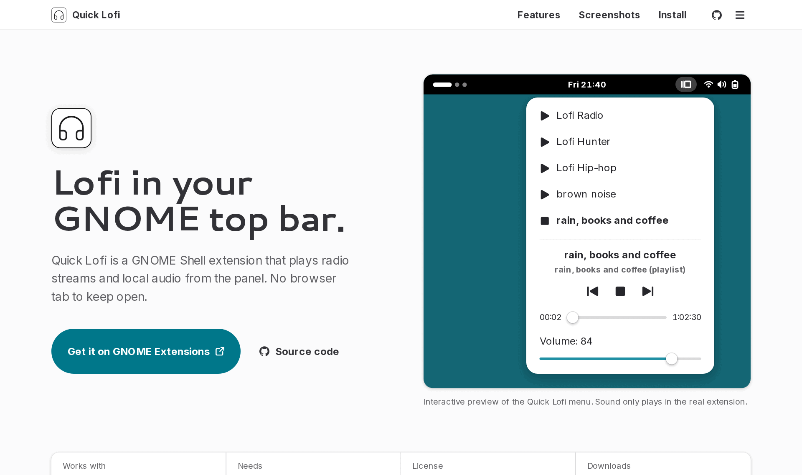

<div align="center">


# Quick Lofi Landing Page

The website for [Quick Lofi](https://github.com/EuCaue/gnome-shell-extension-quick-lofi), a GNOME Shell extension that plays lofi radio and local audio from the top bar.

**[landing-page-quick-lofi.vercel.app](https://landing-page-quick-lofi.vercel.app)**

[](https://landing-page-quick-lofi.vercel.app)
[](https://extensions.gnome.org/extension/6904/quick-lofi/)
[](https://github.com/EuCaue/gnome-shell-extension-quick-lofi)
[](https://ko-fi.com/eucaue)


<picture>
  <source media="(prefers-color-scheme: dark)" srcset="./docs/preview-dark.png" />
  
</picture>

</div>

## About

This repository holds the landing page only. The extension itself lives in [EuCaue/gnome-shell-extension-quick-lofi](https://github.com/EuCaue/gnome-shell-extension-quick-lofi).

The page follows the GNOME Human Interface Guidelines and borrows Libadwaita patterns (header bar, boxed lists, preferences groups, toggle groups, the about dialog) so it reads as part of the GNOME ecosystem. It covers:

- An interactive copy of the panel menu that behaves like the real one: play, pause, stop, the mini player with elapsed time, `LIVE` for streams and a seek bar for files and playlists.
- Features grouped the way the preferences window groups them.
- Screenshots of the panel menu and the Player and Interface settings.
- Install steps, with the mpv command for each distribution and the supported GNOME Shell versions.
- Reviews from extensions.gnome.org.
- Light and dark styles that follow the system, plus the GNOME 47 accent colors in the main menu.

## Tech stack

- [Next.js](https://nextjs.org) (App Router, statically rendered) and React
- [Tailwind CSS](https://tailwindcss.com) v4 with Libadwaita based design tokens
- [next-themes](https://github.com/pacocoursey/next-themes) for the light and dark styles
- [Storybook](https://storybook.js.org) with Vitest, Playwright and axe for component and accessibility tests

There is no animation, carousel or icon library. Icons are the Adwaita symbolic icons stored as path data.

## Development

Requires [Bun](https://bun.sh). The Storybook tests also need Chromium for Playwright.

```bash
bun install
bunx playwright install chromium
```

| Command | What it does |
| --- | --- |
| `bun run dev` | Dev server at http://localhost:3000 |
| `bun run storybook` | Storybook at http://localhost:6006 |
| `bun run lint` | ESLint |
| `bun run typecheck` | TypeScript, no emit |
| `bun run test` | Storybook stories as tests: interactions and accessibility checks |
| `bun run build` | Production build |
| `bun run check` | Everything above, in order |

## Project structure

```text
src/
  app/                 layout, global styles, fonts, SEO routes (sitemap, robots, OG image)
  components/
    adw/               Libadwaita style building blocks (button, boxed list, toggle group...)
    sections/          page sections (hero, features, screenshots, install, reviews, about)
    icons/             Adwaita symbolic icons as path data
    shell-preview.tsx  interactive panel menu
  content/site.ts      every link, fact, station, screenshot and review shown on the page
  stories/             shared Storybook variants and design token stories
public/screenshots/    extension screenshots
```

## Updating content

Most changes only touch `src/content/site.ts`:

- **New release:** update `RELEASE` (version, supported GNOME Shell versions, download count).
- **New screenshot:** put the file in `public/screenshots/` and add an entry to `SCREENSHOTS`. A dark capture is required and a light one is optional. The screenshots section builds its tabs from that list.
- **New review:** add it to `REVIEWS`, quoted as written on extensions.gnome.org. The first entry is the featured one.

Design tokens and component rules are documented in [`DESIGN.md`](./DESIGN.md), and product facts in [`PRODUCT.md`](./PRODUCT.md).

## Support

Issues and feature requests for the extension go to the [extension repository](https://github.com/EuCaue/gnome-shell-extension-quick-lofi/issues). If Quick Lofi helps you focus, you can support it on [Ko-fi](https://ko-fi.com/eucaue).

## Credits

- Icons from the [Adwaita icon theme](https://gitlab.gnome.org/GNOME/adwaita-icon-theme) and [libadwaita](https://gitlab.gnome.org/GNOME/libadwaita).
- GitHub mark from [Simple Icons](https://simpleicons.org).
- Quick Lofi is not affiliated with the GNOME Foundation.

<small>
  <div align="center">
    Made with ❤️ by <a href="https://github.com/EuCaue">EuCaue</a>
  </div>
</small>
